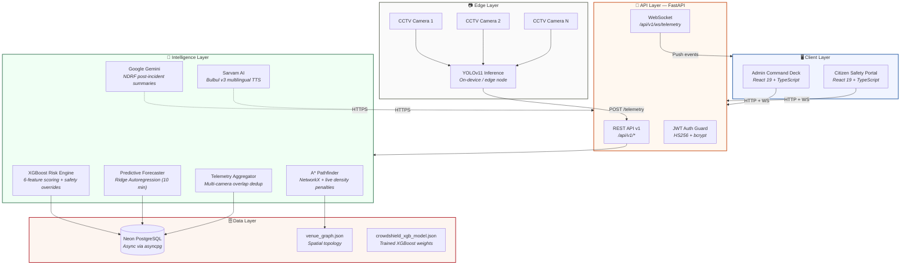
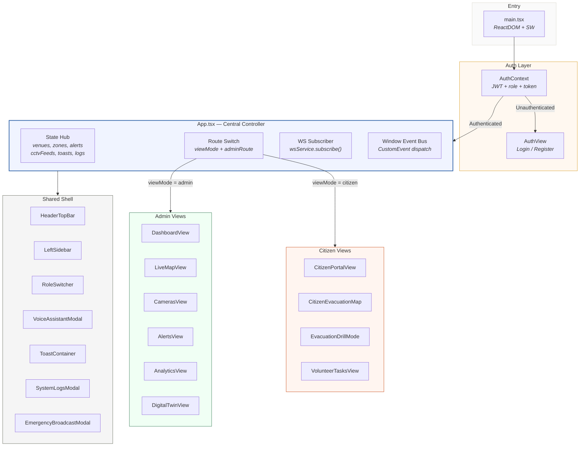
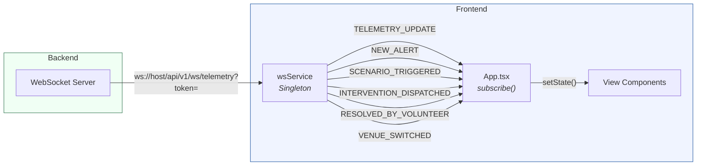
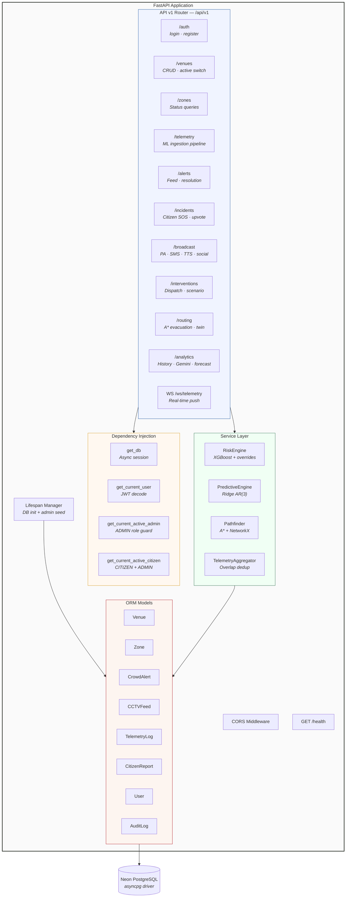
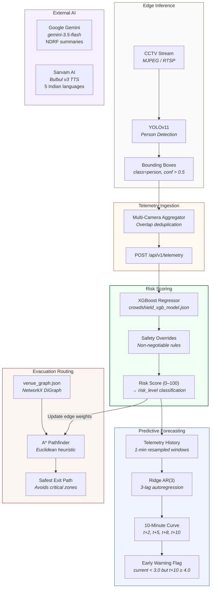
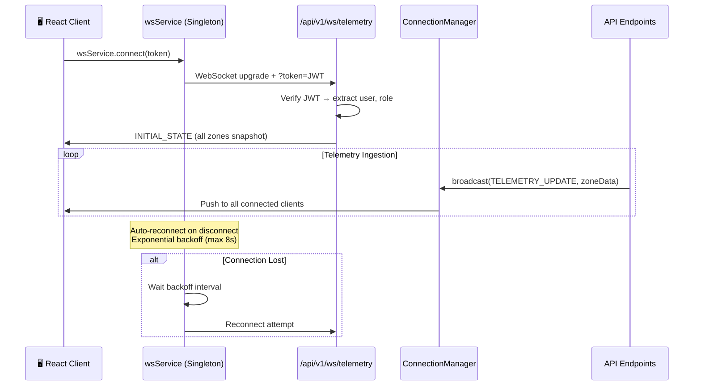
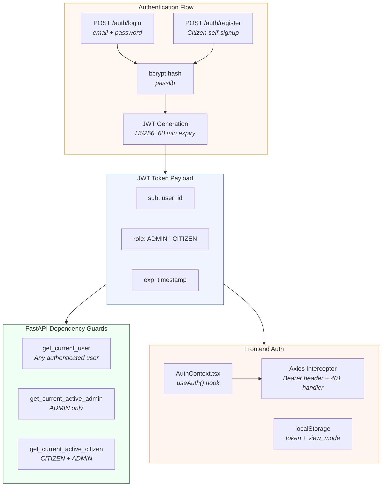
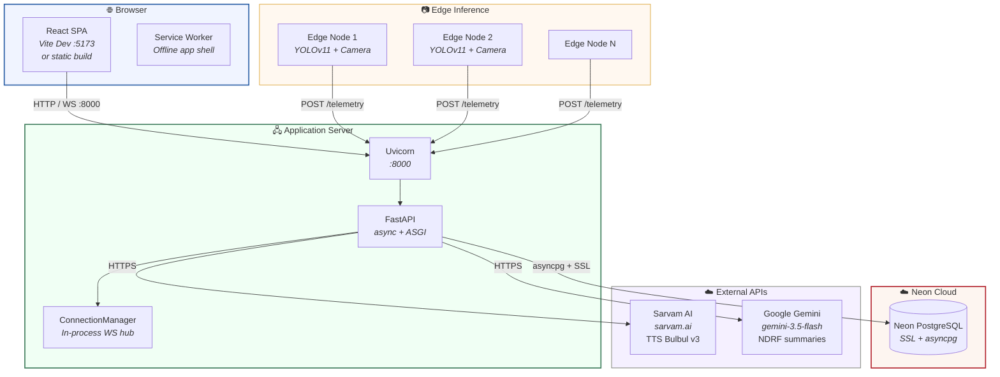

# CrowdShield — System Architecture

> **AI-Powered Crowd Intelligence & Stampede Prevention Platform**
> Real-time crowd density monitoring, predictive risk forecasting, and multi-lingual emergency response — purpose-built for India's largest public venues.

---

## Table of Contents

1. [High-Level System Overview](#1-high-level-system-overview)
2. [Frontend Architecture](#2-frontend-architecture)
3. [Backend Architecture](#3-backend-architecture)
4. [ML & AI Pipeline](#4-ml--ai-pipeline)
5. [Real-Time Communication](#5-real-time-communication)
6. [Authentication & RBAC](#6-authentication--rbac)
7. [Deployment Topology](#8-deployment-topology)

---

## 1. High-Level System Overview

---

## 2. Frontend Architecture

### 2.1 Component Architecture

### 2.2 Real-Time Data Ingestion

The WebSocket service uses **exponential backoff** reconnection (max 8 seconds) and supports zone-level subscriptions.

---

## 3. Backend Architecture

---

## 4. ML & AI Pipeline

---

## 5. Real-Time Communication

---

## 6. Authentication & RBAC

### Role Permissions Matrix

| Capability | Admin | Citizen |
|---|---|---|
| View dashboard & analytics | ✅ | ❌ |
| Trigger scenario drills | ✅ | ❌ |
| Dispatch emergency broadcast | ✅ | ❌ |
| Resolve alerts | ✅ | ❌ |
| Submit SOS reports | ✅ | ✅ |
| View safety feed | ✅ | ✅ |
| Upvote citizen reports | ✅ | ✅ |
| Access evacuation guide | ✅ | ✅ |

---

## 7. Deployment Topology

> **CrowdShield** — Early Warning Crowd Stampede Prevention System
> Built for India's largest public gatherings. Powered by YOLOv11 edge AI, XGBoost risk intelligence, and Sarvam Bhashini multilingual voice alerts.
