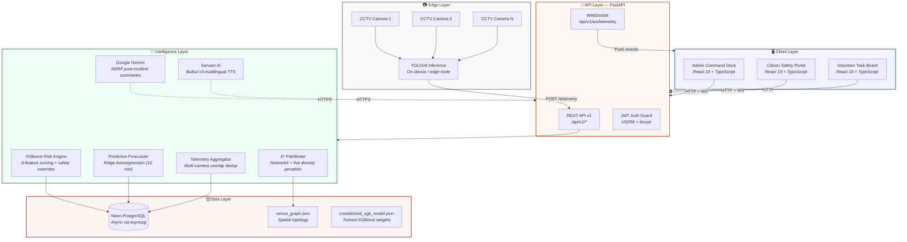
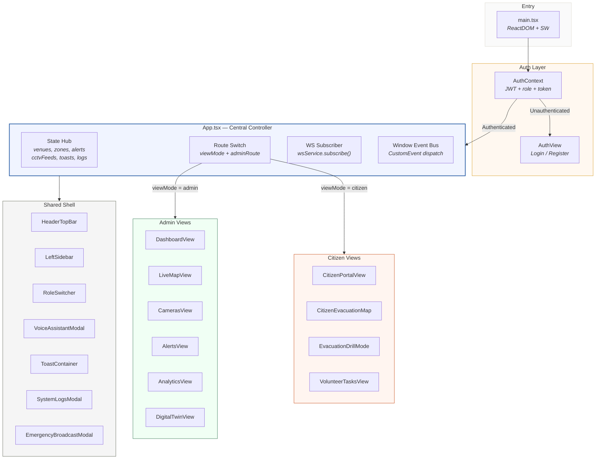
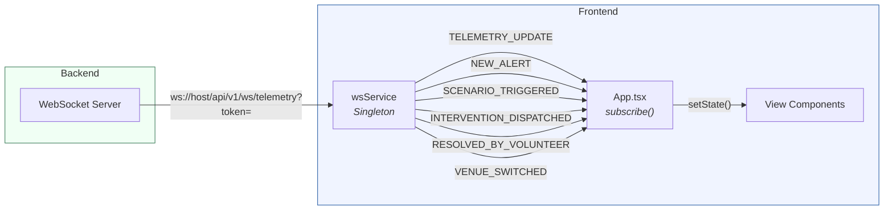
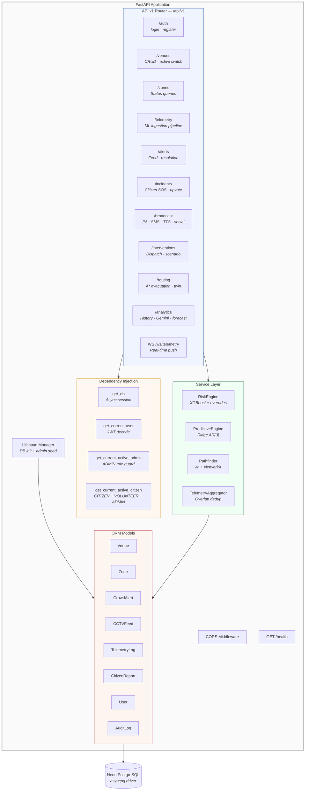
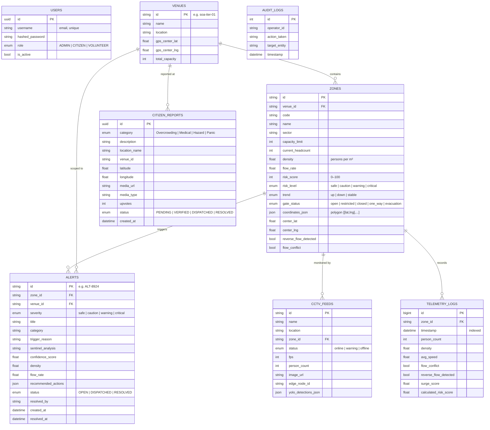
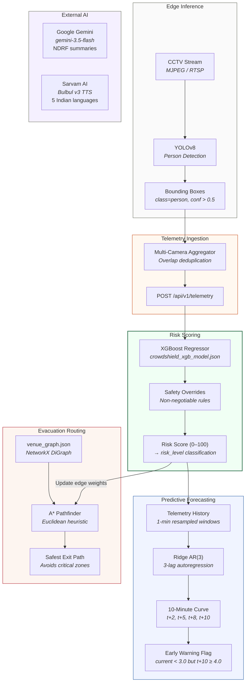
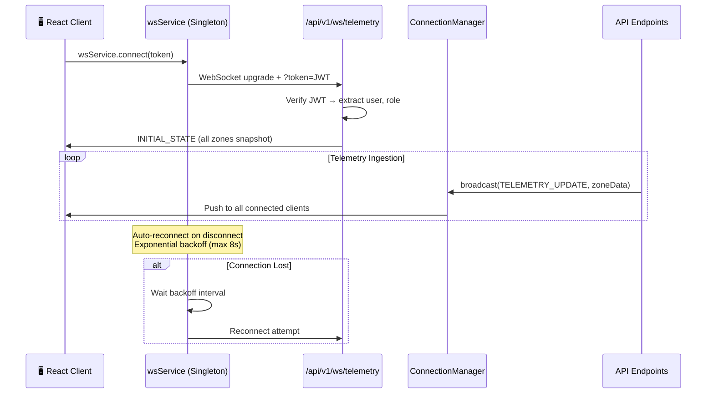
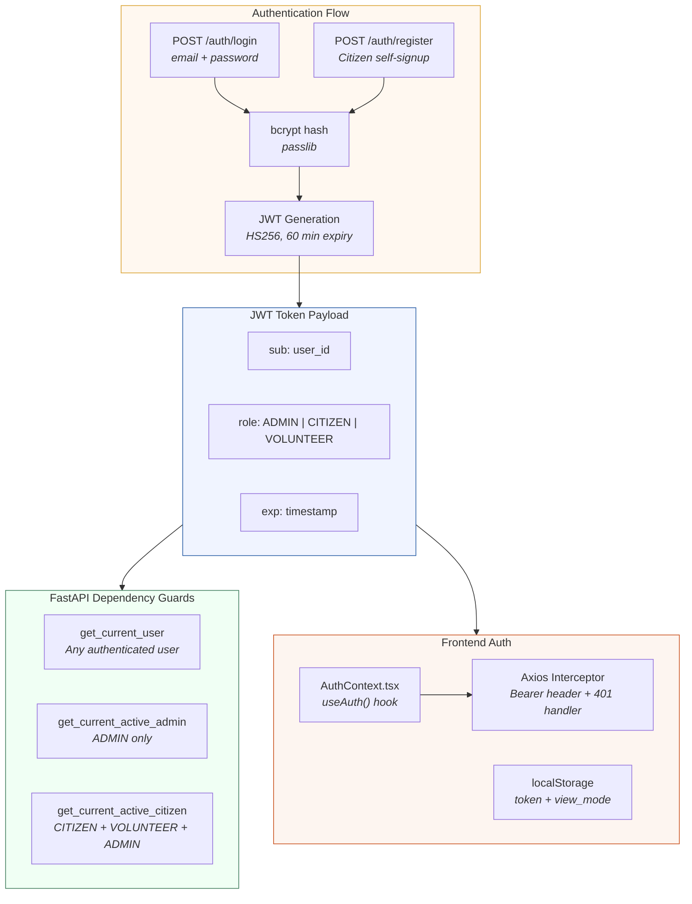
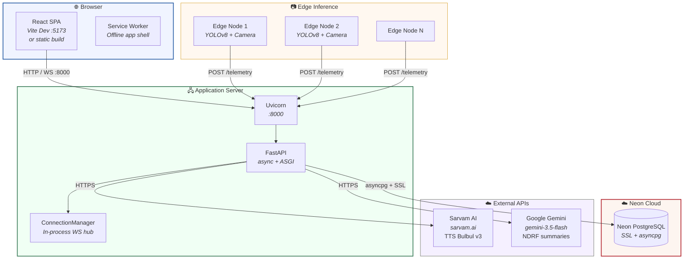

# 🏗️ CrowdShield — System Architecture

> **AI-Powered Crowd Intelligence & Stampede Prevention Platform**
> Real-time crowd density monitoring, predictive risk forecasting, and multi-lingual emergency response — purpose-built for India's largest public venues.

---

## Table of Contents

1. [High-Level System Overview](#1-high-level-system-overview)
2. [Frontend Architecture](#2-frontend-architecture)
3. [Backend Architecture](#3-backend-architecture)
4. [Database Schema](#4-database-schema)
5. [ML & AI Pipeline](#5-ml--ai-pipeline)
6. [Real-Time Communication](#6-real-time-communication)
7. [API Specification](#7-api-specification)
8. [Authentication & RBAC](#8-authentication--rbac)
9. [Data Flow — End to End](#9-data-flow--end-to-end)
10. [Deployment Topology](#10-deployment-topology)
11. [Technology Stack Reference](#11-technology-stack-reference)

---

## 1. High-Level System Overview



---

## 2. Frontend Architecture

### 2.1 Source Tree

```
crowdshield-frontend/src/
├── main.tsx                          # ReactDOM entry + service worker registration
├── App.tsx                           # Central controller: state, routing, WS, polling
├── index.css                         # Design tokens + Tailwind config
├── types.ts                          # All TypeScript interfaces
│
├── context/
│   └── AuthContext.tsx                # JWT auth provider (login, logout, role, token)
│
├── components/
│   ├── admin/
│   │   ├── DashboardView.tsx          # Executive command center overview
│   │   ├── LiveMapView.tsx            # Leaflet GIS map with zone polygons
│   │   ├── CamerasView.tsx            # CCTV grid with YOLO bounding boxes
│   │   ├── AlertsView.tsx             # Real-time alert feed + Sentinel AI panel
│   │   ├── AnalyticsView.tsx          # Historical trends + Gemini AI summaries
│   │   ├── DigitalTwinView.tsx        # 2D/3D venue topology + A* evacuation
│   │   ├── ThreeDigitalTwinCanvas.tsx # Three.js WebGL 3D isometric view
│   │   └── EmergencyBroadcastModal.tsx# Multi-channel crisis PA generator
│   │
│   ├── citizen/
│   │   ├── CitizenPortalView.tsx      # Mobile-first safety UI + SOS button
│   │   ├── CitizenEvacuationMap.tsx    # Turn-by-turn evacuation routing
│   │   ├── EvacuationDrillMode.tsx    # Gamified drill with compass + audio
│   │   └── VolunteerTasksView.tsx     # On-site crowd dispatch task board
│   │
│   ├── common/
│   │   ├── AuthView.tsx               # Login / Register with parallax hero
│   │   ├── HeaderTopBar.tsx           # Venue switcher, search, language, mic
│   │   ├── LeftSidebar.tsx            # Desktop nav + mobile drawer
│   │   ├── RoleSwitcher.tsx           # Floating role toggle + session info
│   │   ├── VoiceAssistantModal.tsx    # Web Speech API voice commands
│   │   ├── ToastContainer.tsx         # Role-aware notification stack
│   │   ├── SystemLogsModal.tsx        # Live backend event console
│   │   └── SupportModal.tsx           # Emergency hotlines + diagnostics
│   │
│   └── ui/
│       └── parallax-hero-images.tsx   # Framer Motion parallax component
│
├── services/
│   └── websocket.ts                   # Singleton WS manager + auto-reconnect
│
├── utils/
│   ├── api.ts                         # Axios instance + JWT interceptors
│   ├── geofence.ts                    # Turf.js proximity to danger zones
│   ├── nlpCommandParser.ts            # Voice transcript → action parser
│   └── speech.ts                      # Sarvam AI TTS + browser fallback
│
├── i18n/
│   ├── dashboard.ts                   # Admin UI translations (5 languages)
│   └── citizen.ts                     # Citizen UI translations (5 languages)
│
├── data/
│   ├── mockData.ts                    # Development mock datasets
│   └── venueTopology.ts              # Client-side venue graph reference
│
└── lib/
    └── utils.ts                       # clsx + tailwind-merge helper
```

### 2.2 Component Architecture



### 2.3 Routing Model

No React Router is used — routing is driven entirely by state:

| State Variable | Values | Controls |
|---|---|---|
| `viewMode` | `'auth'` · `'admin'` · `'citizen'` | Top-level view switch |
| `adminRoute` | `'dashboard'` · `'map'` · `'cameras'` · `'alerts'` · `'analytics'` · `'twin'` | Admin sub-page |

### 2.4 Layout Hierarchy

```
┌───────────────────────────────────────────────────────────────┐
│  Root Container (flex-row, h-screen)                          │
│ ┌──────────────┬────────────────────────────────────────────┐ │
│ │              │  Content Column (flex-col, flex-1)         │ │
│ │              │ ┌────────────────────────────────────────┐ │ │
│ │  LeftSidebar │ │  HeaderTopBar                          │ │ │
│ │  (w-72)      │ │  venue switcher · search · language    │ │ │
│ │              │ ├────────────────────────────────────────┤ │ │
│ │  • Logo      │ │                                        │ │ │
│ │  • Status    │ │  <main> — Dynamic Admin View           │ │ │
│ │  • Nav       │ │  DashboardView | LiveMapView | ...     │ │ │
│ │  • Emergency │ │                                        │ │ │
│ │    PA Button │ │  Overlays: Toasts, Voice, Broadcast    │ │ │
│ │              │ │                                        │ │ │
│ └──────────────┴────────────────────────────────────────────┘ │
└───────────────────────────────────────────────────────────────┘
  Mobile: Sidebar collapses → fixed drawer (z-50, slide-in-from-left)
```

### 2.5 Real-Time Data Ingestion



The WebSocket service uses **exponential backoff** reconnection (max 8 seconds) and supports zone-level subscriptions.

---

## 3. Backend Architecture

### 3.1 Source Tree

```
crowdshield-backend/
├── app/
│   ├── main.py                        # FastAPI app factory + lifespan + CORS
│   │
│   ├── api/
│   │   ├── deps.py                    # Dependency injection (DB session, JWT, RBAC)
│   │   └── v1/
│   │       ├── api.py                 # Aggregated v1 router
│   │       ├── websocket.py           # WS endpoint with JWT handshake
│   │       └── endpoints/
│   │           ├── auth.py            # Login + citizen registration
│   │           ├── venues.py          # Multi-venue CRUD + active switching
│   │           ├── zones.py           # Zone status queries
│   │           ├── telemetry.py       # ML telemetry ingestion pipeline
│   │           ├── alerts.py          # Alert queries + volunteer resolution
│   │           ├── incidents.py       # Citizen SOS + upvoting
│   │           ├── broadcast.py       # Sarvam TTS + SMS + social dispatch
│   │           ├── interventions.py   # Countermeasures + scenario toggle
│   │           ├── routing.py         # A* evacuation + 3D twin queries
│   │           └── analytics.py       # History + Gemini summaries + forecast
│   │
│   ├── core/
│   │   ├── config.py                  # Pydantic BaseSettings (.env loader)
│   │   ├── security.py                # bcrypt hashing + PyJWT token utils
│   │   └── websocket.py               # ConnectionManager singleton
│   │
│   ├── db/
│   │   ├── base.py                    # SQLAlchemy DeclarativeBase
│   │   └── session.py                 # Async engine + sessionmaker (Neon PG)
│   │
│   ├── models/
│   │   ├── venue.py                   # Venue + Zone ORM
│   │   ├── alert.py                   # CrowdAlert ORM
│   │   ├── camera.py                  # CCTVFeed ORM
│   │   ├── incident.py                # CitizenReport ORM
│   │   ├── telemetry.py               # TelemetryLog ORM
│   │   ├── user.py                    # User + UserRole ORM
│   │   └── audit.py                   # AuditLog ORM
│   │
│   ├── schemas/                       # Pydantic request/response models
│   │   ├── zone.py
│   │   ├── alert.py
│   │   ├── incident.py
│   │   ├── telemetry.py
│   │   ├── token.py
│   │   └── user.py
│   │
│   └── services/
│       ├── risk_engine.py             # XGBoost scoring + safety overrides
│       ├── predictive_engine.py       # Ridge autoregression (10-min forecast)
│       ├── pathfinding.py             # Dynamic A* over venue graph
│       └── telemetry_aggregator.py    # Multi-camera overlap deduplication
│
├── scripts/
│   ├── seed_venue.py                  # Seeds SOA ITER + Kalinga Stadium
│   ├── simulate_telemetry.py          # Telemetry simulator (normal + crisis)
│   └── cleanup_venues.py             # DB cleanup utility
│
├── venue_graph.json                   # Spatial graph topology
├── crowdshield_xgb_model.json         # Trained XGBoost weights
├── crowdshield_training_data.csv      # 2,500-row synthetic training set
├── train_xgboost_model.py             # XGBoost training script
├── generate_synthetic_data.py         # Physics-grounded data generator
├── requirements.txt
└── .env
```

### 3.2 Application Architecture



---

## 4. Database Schema



### Pre-Seeded Venues

| Venue ID | Name | Location | Zones |
|---|---|---|---|
| `soa-iter-01` | SOA ITER Campus | Bhubaneswar, Odisha | `gate_1`, `zone_admin_block_rd`, `zone_library_roundabout`, `zone_sports_complex_rd`, `gate_2`, `zone_e_block_lawn_rd` |
| `kalinga-stadium-01` | Kalinga International Stadium | Nayapalli, Bhubaneswar | `ks_gate_3`, `ks_sky_walk`, `ks_swimming`, `ks_athletics`, `ks_parking`, `ks_badminton` |

---

## 5. ML & AI Pipeline

### 5.1 Intelligence Stack Overview



### 5.2 XGBoost Risk Engine

**Input Features:**

| Feature | Source | Description |
|---|---|---|
| `density` | Camera headcount / zone area | Persons per m² |
| `avg_speed` | Optical flow estimation | Average pedestrian speed |
| `flow_conflict` | Directional analysis | Counter-flows detected (bool) |
| `reverse_flow_detected` | Optical flow | Crowd moving against expected direction |
| `capacity_ratio` | headcount / max_capacity | Zone fill percentage |
| `surge_score` | Δ headcount / Δ time | Rate of crowd inflow |

**Deterministic Safety Overrides (non-negotiable):**

| Condition | Override | Rationale |
|---|---|---|
| Reverse flow AND density > 3.0 p/m² | Risk score += 20.0 | Stampede precursor pattern |
| Capacity ratio > 0.85 AND surge > 0.7 | Minimum risk = 75.0 (Warning) | Overcapacity with rapid inflow |
| Density > 4.25 p/m² | Minimum risk = 90.0 (Critical) | Lethal crush threshold |

### 5.3 Risk Classification

| Density (p/m²) | Risk Level | Color | Response |
|---|---|---|---|
| < 2.0 | **Safe** | 🟢 `#3F7D5C` | Normal operations |
| 2.0 – 3.0 | **Caution** | 🟡 `#D9A02D` | Increased monitoring |
| 3.0 – 4.0 | **Warning** | 🟠 `#C9501C` | Flow control + gate restrictions |
| > 4.0 | **Critical** | 🔴 `#B3242E` | Emergency evacuation |

### 5.4 A* Pathfinding Cost Function

Edge traversal cost is dynamically weighted by live crowd density:

$$\text{Cost}(u, v) = d_{\text{physical}} \times \exp\!\bigl(\min(\rho \times 0.4,\; 10.0)\bigr) \times R$$

Where:
- $d_{\text{physical}}$ = Euclidean distance between nodes
- $\rho$ = Current density (p/m²) of the target zone
- $R$ = Risk multiplier: **Critical** = $8.0\times$, **Warning/Caution** = $2.5\times$, **Safe** = $1.0\times$

### 5.5 Multi-Camera Overlap Deduplication

$$\text{True Headcount} = \sum_{i} C_i - \sum_{(A,B) \in \text{overlaps}} \alpha_{AB} \times \min(C_A, C_B)$$

Where $\alpha_{AB}$ is the pre-calibrated overlap ratio between adjacent camera zones defined in `venue_graph.json`.

---

## 6. Real-Time Communication

### 6.1 WebSocket Architecture



### 6.2 Event Types

| Event | Direction | Payload | Trigger |
|---|---|---|---|
| `INITIAL_STATE` | Server → Client | Full zone array | On WebSocket connect |
| `TELEMETRY_UPDATE` | Server → Client | Zone metrics + risk + forecast + route | POST /telemetry processed |
| `NEW_ALERT` | Server → Client | Alert object | Risk threshold breached |
| `SCENARIO_TRIGGERED` | Server → Client | Scenario metadata | Admin triggers stampede drill |
| `SCENARIO_RESET` | Server → Client | Reset confirmation | Admin resets scenario |
| `INTERVENTION_DISPATCHED` | Server → Client | Action details | PA / SMS / gate action executed |
| `RESOLVED_BY_VOLUNTEER` | Server → Client | Alert + volunteer info | Volunteer marks alert resolved |
| `CITIZEN_HAZARD_SUBMITTED` | Server → Client | Citizen report | SOS report submitted |
| `HAZARD_STATUS_UPDATED` | Server → Client | Updated report | Admin validates report |
| `VENUE_SWITCHED` | Server → Client | New venue ID | Active venue changed |
| `SOCIAL_MEDIA_DISPATCHED` | Server → Client | Platform + message | Social alert sent |

### 6.3 Hybrid Strategy: Polling + Push

| Method | Channel | Frequency | Use Case |
|---|---|---|---|
| **WebSocket Push** | `ws://` | Instant | Critical alerts, telemetry, broadcasts |
| **Stale Detection** | Frontend timer | Every 10s | Flag stale feeds if no WS update received |
| **On-Demand REST** | `http://` | User-triggered | Evacuation routes, TTS, analytics export |

---

## 7. API Specification

### 7.1 Authentication

| Method | Path | Auth | Description |
|---|---|---|---|
| `POST` | `/api/v1/auth/login` | None | Unified JWT login (Admin / Citizen / Volunteer) |
| `POST` | `/api/v1/auth/register` | None | Citizen self-registration |

### 7.2 Venue & Zone Management

| Method | Path | Auth | Description |
|---|---|---|---|
| `GET` | `/api/v1/venues/` | JWT | List all venues with nested zones |
| `GET` | `/api/v1/venues/{venue_id}` | JWT | Single venue with zones |
| `GET` | `/api/v1/venues/active` | JWT | Get currently active venue |
| `POST` | `/api/v1/venues/active` | Admin | Set active venue (broadcasts `VENUE_SWITCHED`) |
| `GET` | `/api/v1/zones/` | JWT | Zone list (filterable by `?venue_id=`) |
| `GET` | `/api/v1/zones/{zone_id}` | JWT | Single zone status |

### 7.3 Telemetry & Intelligence

| Method | Path | Auth | Description |
|---|---|---|---|
| `POST` | `/api/v1/telemetry/` | JWT | Ingest edge telemetry → XGBoost → alerts → WS broadcast |

### 7.4 Alerts & Incidents

| Method | Path | Auth | Description |
|---|---|---|---|
| `GET` | `/api/v1/alerts/` | Admin | Active alert feed |
| `PATCH` | `/api/v1/alerts/{alert_id}/status` | JWT | Volunteer resolution loop |
| `POST` | `/api/v1/incidents/` | Citizen+ | Submit citizen SOS report |
| `GET` | `/api/v1/incidents/` | JWT | Fetch reports (newest first) |
| `PATCH` | `/api/v1/incidents/{id}/status` | Admin | Verify / resolve incident |
| `PATCH` | `/api/v1/incidents/{id}/upvote` | Citizen+ | Community upvote |

### 7.5 Emergency Broadcast

| Method | Path | Auth | Description |
|---|---|---|---|
| `POST` | `/api/v1/broadcast/` | Admin | Sarvam AI multilingual PA via WS |
| `POST` | `/api/v1/broadcast/sms` | Admin | Simulated cellular SMS broadcast |
| `POST` | `/api/v1/broadcast/sarvam-tts` | JWT | Text-to-Speech (Sarvam Bulbul v3) |
| `POST` | `/api/v1/broadcast/social` | Admin | Social media emergency dispatch |

### 7.6 Interventions & Scenarios

| Method | Path | Auth | Description |
|---|---|---|---|
| `POST` | `/api/v1/interventions/dispatch` | Admin | Dispatch countermeasure + resolve alerts |
| `POST` | `/api/v1/interventions/scenario` | Admin | Trigger / reset stampede simulation |
| `GET` | `/api/v1/interventions/scenario/status` | JWT | Check active scenario state |

### 7.7 Routing & Digital Twin

| Method | Path | Auth | Description |
|---|---|---|---|
| `POST` | `/api/v1/routing/evacuate` | JWT | A* evacuation path to nearest safe exit |
| `POST` | `/api/v1/routing/query` | JWT | Flexible 3D twin graph query |

### 7.8 Analytics & Forecasting

| Method | Path | Auth | Description |
|---|---|---|---|
| `GET` | `/api/v1/analytics/history` | Admin | 24h aggregated footfall + bottleneck data |
| `POST` | `/api/v1/analytics/generate-summary/{id}` | Admin | Gemini NDRF post-incident summary |
| `GET` | `/api/v1/analytics/audit-logs` | Admin | NDRF compliance audit trail |
| `GET` | `/api/v1/analytics/predictive-forecast/{zone_id}` | Admin | 10-minute density prediction curve |

---

## 8. Authentication & RBAC



### Role Permissions Matrix

| Capability | Admin | Volunteer | Citizen |
|---|---|---|---|
| View dashboard & analytics | ✅ | ❌ | ❌ |
| Trigger scenario drills | ✅ | ❌ | ❌ |
| Dispatch emergency broadcast | ✅ | ❌ | ❌ |
| Resolve alerts | ✅ | ✅ | ❌ |
| Submit SOS reports | ✅ | ✅ | ✅ |
| View safety feed | ✅ | ✅ | ✅ |
| Upvote citizen reports | ✅ | ✅ | ✅ |
| Access evacuation guide | ✅ | ✅ | ✅ |

---

## 9. Data Flow — End to End

```mermaid
sequenceDiagram
    participant CAM as 📷 CCTV Camera
    participant YOLO as 🧠 YOLOv8
    participant AGG as 📊 Aggregator
    participant API as 🔀 POST /telemetry
    participant XGB as ⚡ XGBoost Engine
    participant OVER as 🛡️ Safety Overrides
    participant RIDGE as 📈 Ridge Forecaster
    participant ASTAR as 🗺️ A* Pathfinder
    participant DB as 🗄️ PostgreSQL
    participant WS as ⚡ WebSocket
    participant UI as 🖥️ React UI

    CAM->>YOLO: MJPEG frame
    YOLO->>YOLO: Detect persons (conf > 0.5)
    YOLO->>AGG: Zone headcounts
    AGG->>AGG: Overlap dedup (α coefficients)
    AGG->>API: Aggregated telemetry payload

    API->>XGB: Feature vector (6 features)
    XGB->>XGB: Predict risk score (0–100)
    XGB->>OVER: Raw score
    OVER->>OVER: Apply safety floor rules

    Note over OVER: density > 4.25 → min 90<br/>reverse + dense → +20<br/>cap > 0.85 + surge → min 75

    OVER->>DB: UPDATE zone (density, risk, headcount)
    OVER->>DB: INSERT telemetry_log

    alt Risk threshold breached
        OVER->>DB: INSERT alert (OPEN)
        OVER->>WS: Emit NEW_ALERT
    end

    API->>RIDGE: Query recent telemetry
    RIDGE->>RIDGE: Fit AR(3), project 10 min
    RIDGE->>API: Forecast curve + early warning

    API->>ASTAR: Update edge weights (live density)
    ASTAR->>ASTAR: Compute path to nearest safe exit
    ASTAR->>API: Evacuation route

    API->>WS: Emit TELEMETRY_UPDATE
    WS->>UI: Push zone + forecast + route
    UI->>UI: Re-render views
```

---

## 10. Deployment Topology



### Port & Service Map

| Service | Port | Protocol | Notes |
|---|---|---|---|
| Vite Dev Server | `5173` | HTTP | HMR-enabled dev mode |
| Uvicorn (FastAPI) | `8000` | HTTP + WS | ASGI async server |
| Neon PostgreSQL | `5432` | TCP (SSL) | Cloud-hosted, asyncpg driver |
| Sarvam AI | `443` | HTTPS | External TTS API |
| Google Gemini | `443` | HTTPS | External generative AI |
| CCTV Streams | Varies | MJPEG / RTSP | Per-camera edge feed |

---

## 11. Technology Stack Reference

### Frontend

| Layer | Technology | Version | Purpose |
|---|---|---|---|
| UI Framework | React | 19.2 | Component rendering |
| Language | TypeScript | 5.8 | Static type safety |
| Bundler | Vite | 6.2 | Fast HMR + production builds |
| Styling | TailwindCSS | 4.1 | Utility-first CSS |
| Animation | Framer Motion | 13.1 | Micro-interactions + parallax |
| Charts | Recharts | 3.10 | Area charts, density trends |
| Maps | Leaflet + React-Leaflet | 1.9 / 5.0 | GIS zone overlays |
| 3D Engine | Three.js + R3F | 0.185 | Digital twin WebGL canvas |
| Geospatial | Turf.js | 7.4 | Geofence proximity calculations |
| HTTP Client | Axios | 1.19 | REST API + JWT interceptors |
| Icons | Lucide React | 0.546 | Consistent icon system |
| AI SDK | Google GenAI | 2.4 | Client-side Gemini integration |
| Testing | Playwright | 1.62 | E2E browser tests |

### Backend

| Layer | Technology | Version | Purpose |
|---|---|---|---|
| Framework | FastAPI | 0.115 | Async REST + WebSocket |
| Server | Uvicorn | 0.34 | ASGI production server |
| ORM | SQLAlchemy (async) | 2.0 | Async database operations |
| DB Driver | asyncpg | 0.30 | PostgreSQL async adapter |
| Database | Neon PostgreSQL | Cloud | Managed serverless Postgres |
| ML — Risk | XGBoost | 3.0 | Gradient-boosted risk scoring |
| ML — Forecast | scikit-learn (Ridge) | 1.6 | Autoregressive density prediction |
| Graph | NetworkX | 3.5 | A* pathfinding over venue topology |
| Auth | python-jose + passlib | — | JWT HS256 + bcrypt hashing |
| Config | Pydantic Settings | 2.9 | Typed environment configuration |
| AI — Summaries | Google Gemini SDK | 0.2 | NDRF post-incident reports |
| AI — TTS | Sarvam AI (Bulbul v3) | — | 5-language Indian voice synthesis |

### Multilingual Support

| Language | Code | Script | Used In |
|---|---|---|---|
| English | `en` | Latin | Dashboard + Citizen UI |
| Hindi | `hi` | Devanagari (हिन्दी) | PA + Citizen + TTS |
| Odia | `od` | Odia (ଓଡ଼ିଆ) | PA + Citizen + TTS |
| Bengali | `bn` | Bengali (বাংলা) | PA + Citizen + TTS |
| Tamil | `ta` | Tamil (தமிழ்) | PA + Citizen + TTS |

### Design System — Cartographic Theme

| Token | Hex | Role |
|---|---|---|
| Background | `#F8F7F4` | Warm stone-paper canvas |
| Surface | `#FFFFFF` | Card surfaces |
| Primary Text | `#22271F` | Warm charcoal ink |
| Secondary Text | `#6B7062` | Muted olive-gray |
| Border | `#DEDBD1` | Warm light stone hairlines |
| Accent | `#2B5FA6` | Compass blue — buttons, links, active states |
| Risk Safe | `#3F7D5C` | Moss-teal green |
| Risk Caution | `#D9A02D` | Ochre-gold |
| Risk Warning | `#C9501C` | Instrument orange |
| Risk Critical | `#B3242E` | Survey-map red |

### Typography

| Role | Typeface | Weights | Usage |
|---|---|---|---|
| Display / Headings | Space Grotesk | 500, 600, 700 | Page titles, section headers |
| Body / UI | Sora | 400, 500, 600 | Body text, buttons, labels |
| Data / Telemetry | JetBrains Mono | 400, 500, 600, 700 | Metrics, timestamps, codes |

---

> **CrowdShield** — Early Warning Crowd Stampede Prevention System
> Built for India's largest public gatherings. Powered by YOLOv8 edge AI, XGBoost risk intelligence, and Sarvam Bhashini multilingual voice alerts.
