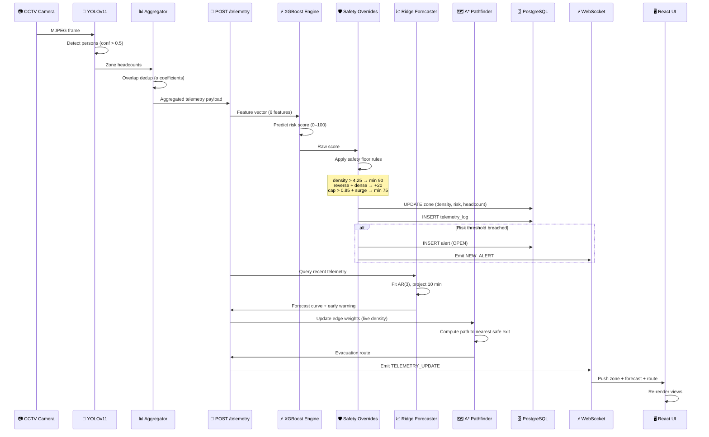

## Data Flow — End to End

```mermaid
sequenceDiagram
    participant CAM as 📷 CCTV Camera
    participant YOLO as 🧠 YOLOv11
    participant AGG as 📊 Aggregator
    participant API as 🔀 POST /telemetry
    participant XGB as ⚡ XGBoost Engine
    participant OVR as 🛡️ Safety Overrides
    participant RIDGE as 📈 Ridge Forecaster
    participant ASTAR as 🗺️ A* Pathfinder
    participant DB as 🗄️ PostgreSQL
    participant WS as ⚡ WebSocket
    participant UI as 🖥️ React UI

    CAM->>YOLO: MJPEG frame
    YOLO->>YOLO: Detect persons (conf > 0.5)
    YOLO->>AGG: Zone headcounts
    AGG->>AGG: Overlap dedup (α coefficients)
    AGG->>API: Aggregated telemetry payload

    API->>XGB: Feature vector (6 features)
    XGB->>XGB: Predict risk score (0–100)
    XGB->>OVR: Raw score
    OVR->>OVR: Apply safety floor rules

    Note over OVR: density > 4.25 → min 90<br/>reverse + dense → +20<br/>cap > 0.85 + surge → min 75

    OVR->>DB: UPDATE zone (density, risk, headcount)
    OVR->>DB: INSERT telemetry_log

    alt Risk threshold breached
        OVR->>DB: INSERT alert (OPEN)
        OVR->>WS: Emit NEW_ALERT
    end

    API->>RIDGE: Query recent telemetry
    RIDGE->>RIDGE: Fit AR(3), project 10 min
    RIDGE->>API: Forecast curve + early warning

    API->>ASTAR: Update edge weights (live density)
    ASTAR->>ASTAR: Compute path to nearest safe exit
    ASTAR->>API: Evacuation route

    API->>WS: Emit TELEMETRY_UPDATE
    WS->>UI: Push zone + forecast + route
    UI->>UI: Re-render views
```

---
