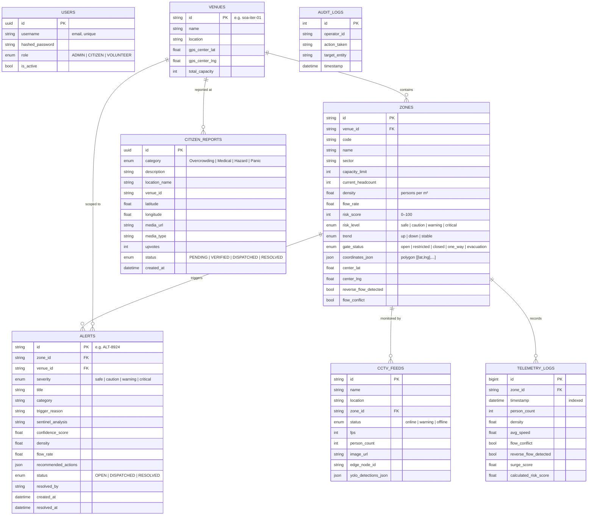

## Database Schema

### Pre-Seeded Venues

| Venue ID | Name | Location | Zones |
|---|---|---|---|
| `soa-iter-01` | SOA ITER Campus | Bhubaneswar, Odisha | `gate_1`, `zone_admin_block_rd`, `zone_library_roundabout`, `zone_sports_complex_rd`, `gate_2`, `zone_e_block_lawn_rd` |
| `kalinga-stadium-01` | Kalinga International Stadium | Nayapalli, Bhubaneswar | `ks_gate_3`, `ks_sky_walk`, `ks_swimming`, `ks_athletics`, `ks_parking`, `ks_badminton` |

---