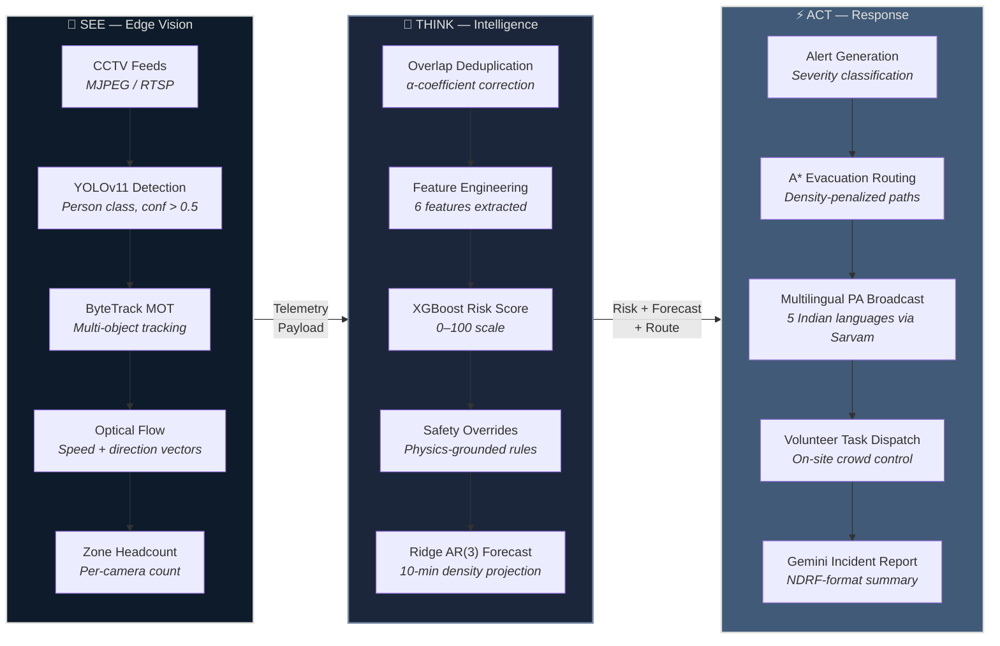
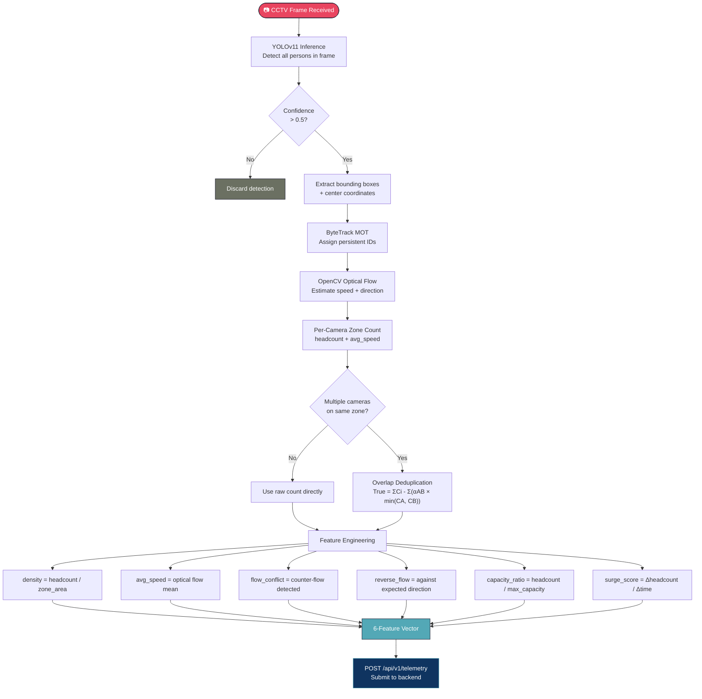
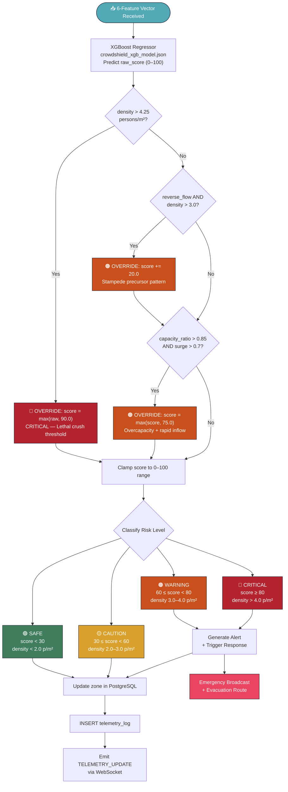
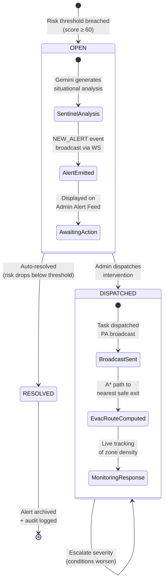
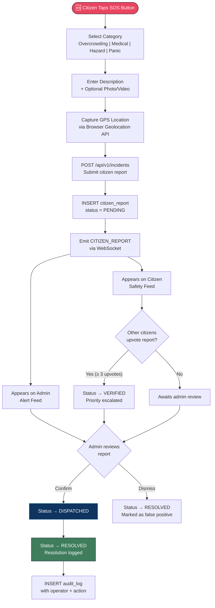
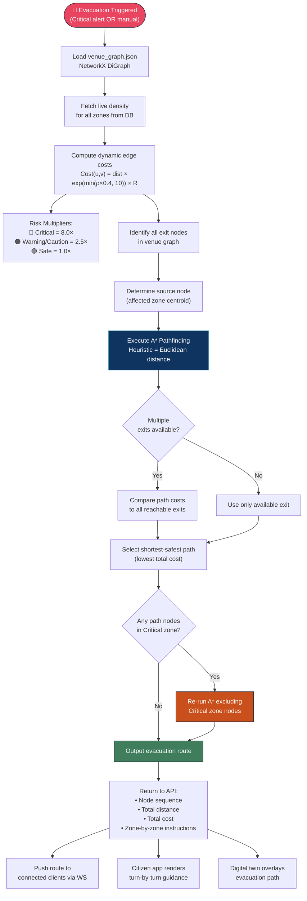
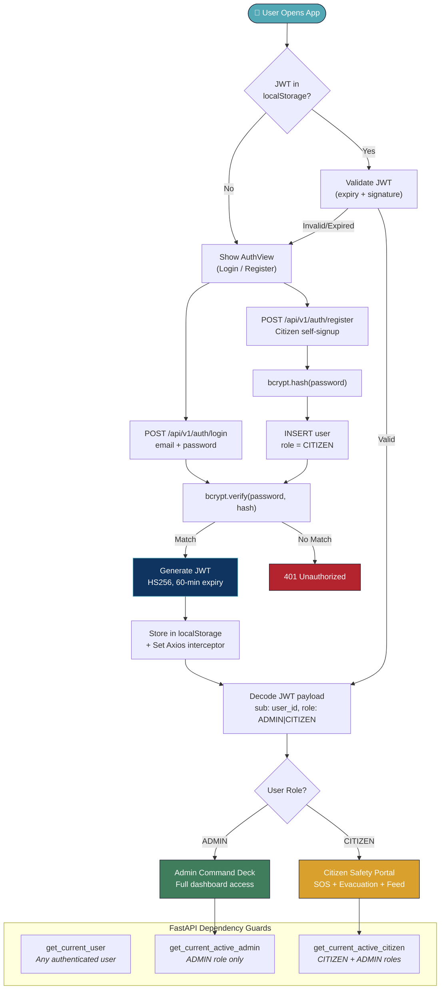

# CrowdShield — Flowcharts

### AI-Powered Early Warning Crowd Stampede Prevention System

---

## Table of Contents

1. [Three-Layer Pipeline — See · Think · Act](#2-three-layer-pipeline--see--think--act)
2. [Telemetry Ingestion Pipeline](#4-telemetry-ingestion-pipeline)
3. [XGBoost Risk Scoring Engine — Decision Flowchart](#5-xgboost-risk-scoring-engine--decision-flowchart)
4. [Alert Lifecycle — State Machine](#6-alert-lifecycle--state-machine)
5. [Citizen SOS Workflow](#7-citizen-sos-workflow)
6. [A* Evacuation Routing Flowchart](#8-a-evacuation-routing-flowchart)
7. [Authentication & RBAC Flow](#9-authentication--rbac-flow)

---

## 1. Three-Layer Pipeline — See · Think · Act

CrowdShield's core philosophy follows a **See → Think → Act** pipeline that mirrors human decision-making but operates at machine speed.

---

## 2. Telemetry Ingestion Pipeline

Detailed view of how raw camera data is transformed into actionable intelligence.

---

## 3. XGBoost Risk Scoring Engine — Decision Flowchart

This flowchart shows the complete risk scoring pipeline, including the deterministic safety overrides that enforce non-negotiable escalation rules.

---

## 4. Alert Lifecycle — State Machine

Every alert follows a strict state machine from creation to resolution.

---

## 5. Citizen SOS Workflow

Flowchart showing how citizen-reported incidents are processed from mobile SOS to volunteer dispatch.

---

## 6. A* Evacuation Routing Flowchart

Shows how the dynamic evacuation routing system computes the safest exit path using live density data.

---

## 7. Authentication & RBAC Flow

### Role Permissions Matrix

| Capability | Admin | Citizen |
|---|:---:|:---:|
| View dashboard & analytics | ✅ | ❌ |
| Trigger scenario drills | ✅ | ❌ |
| Dispatch emergency broadcast | ✅ | ❌ |
| Resolve alerts | ✅ | ❌ |
| Submit SOS reports | ✅ | ✅ |
| View citizen safety feed | ✅ | ✅ |
| Upvote citizen reports | ✅ | ✅ |
| Access evacuation guide | ✅ | ✅ |

---

**CrowdShield** — *Because every second counts when crowds become critical.*

Built with ❤️ by **Team Juggernaut** for **TechNova Season 3**

